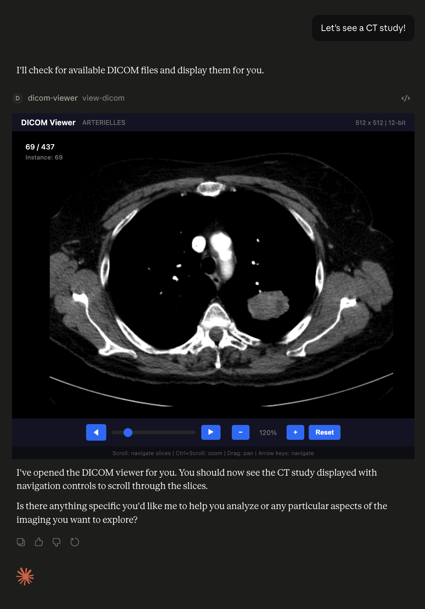

# DICOM Viewer MCP App

A prototype MCP (Model Context Protocol) App that displays DICOM medical images directly within LLM chat interfaces, including Claude Desktop. Built using the [MCP Apps SDK](https://github.com/modelcontextprotocol/ext-apps).



## Features

- View DICOM medical images directly within Claude Desktop
- **Series navigation** - browse through multiple slices with slider, buttons, or scroll wheel
- **Keyboard shortcuts** - arrow keys for navigation, Home/End for first/last slice
- Pan and zoom controls for image inspection
- Displays image metadata (dimensions, bit depth, instance number)
- Server-side rendering using `dicom-parser` and `sharp`
- Handles DICOM window/level and rescale slope/intercept
- Automatic sorting by Instance Number or Slice Location

## How It Works

1. The MCP server scans the `./dicom/` folder for all `.dcm` files
2. Parses each DICOM file using `dicom-parser`
3. Converts pixel data to PNG using `sharp` with proper windowing
4. Sorts slices by Instance Number or Slice Location
5. Embeds all images in the HTML resource sent to Claude Desktop
6. The client displays images with interactive navigation controls

This approach avoids CSP (Content Security Policy) restrictions in Claude Desktop by doing all DICOM processing server-side.

## Prerequisites

- Node.js 18+
- Claude Desktop with MCP support

## Installation

```bash
# Clone the repository
git clone https://github.com/ThalesMMS/dicom-viewer-mcp-app.git
cd dicom-viewer-mcp-app

# Install dependencies
npm install

# Build the project
npm run build
```

## Usage

### 1. Add your DICOM files

Place your DICOM files (`.dcm`) in the `./dicom/` folder:

```
./dicom/
├── IM-0001-0001.dcm
├── IM-0001-0002.dcm
├── IM-0001-0003.dcm
└── ...
```

### 2. Configure Claude Desktop

Add the server to your Claude Desktop configuration:

**macOS:** `~/Library/Application Support/Claude/claude_desktop_config.json`

```json
{
  "mcpServers": {
    "dicom-viewer": {
      "command": "node",
      "args": [
        "/absolute/path/to/dicom-viewer-mcp-app/dist/index.js",
        "--stdio"
      ]
    }
  }
}
```

### 3. Restart Claude Desktop

After updating the configuration, fully quit and restart Claude Desktop.

### 4. View DICOM images

Ask Claude to "show me a DICOM study" or "use the view-dicom tool".

## Controls

| Action | Control |
|--------|---------|
| Navigate slices | Scroll wheel, slider, or ◀/▶ buttons |
| Navigate slices (keyboard) | Arrow keys (←/→ or ↑/↓) |
| First/Last slice | Home / End keys |
| Zoom | Ctrl + Scroll wheel, or +/− buttons |
| Pan | Click and drag |
| Reset view | Reset button |

## Development

```bash
# Build and run in development mode
npm start

# Or run with hot reload
npm run dev
```

## Project Structure

```
dicom-viewer-mcp-app/
├── dicom/                  # Place DICOM files here (a single series)
│   └── .gitkeep
├── src/
│   ├── mcp-app.tsx        # React client component
│   ├── mcp-app.module.css # Styles
│   └── global.css
├── server.ts              # MCP server with DICOM processing
├── main.ts                # Entry point (stdio/HTTP transport)
├── mcp-app.html           # HTML template
├── package.json
└── README.md
```

## Technical Details

### DICOM Processing

The server handles:
- 8-bit and 16-bit pixel data (signed and unsigned)
- MONOCHROME1 and MONOCHROME2 photometric interpretations
- Rescale slope and intercept transformations
- Window center and window width adjustments
- Automatic slice sorting by Instance Number or Slice Location

### Supported DICOM Transfer Syntaxes

Currently supports uncompressed DICOM files (Explicit/Implicit VR Little Endian). Compressed transfer syntaxes (JPEG, JPEG 2000, etc.) are not yet supported.

## Limitations

- Uncompressed DICOM only (no JPEG/JPEG2000 compression)
- All slices are loaded at once (may be slow for very large series)
- Single series at a time

## Citation

If you use this software, please cite it using the metadata in [CITATION.cff](CITATION.cff):

```text
Thales Matheus Mendonça Santos. DICOM Viewer MCP App. Version 1.0.0. 2026-06-08. https://github.com/ThalesMMS/dicom-viewer-mcp-app
```

## Author

**Thales Matheus Mendonça Santos** - [GitHub](https://github.com/ThalesMMS)

## License

MIT
